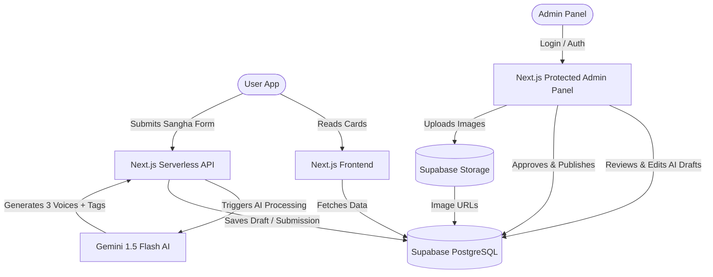

# Implementation Plan: Modernizing ShunyaMarg (Next.js + Scalable Database + AI Admin Workflow)

This plan outlines the architectural modernization of ShunyaMarg from a monolithic single-page site to a production-grade, highly scalable, AI-powered web application built with **Next.js (App Router)** and deployed on **Vercel**. 

---

## Technical Architecture Overview



---

## Proposed Tech Stack & Database Schema

### 1. The Core Stack
* **Framework**: **Next.js 14+ (App Router)**. This provides perfect deployment optimization on Vercel, unified frontend and backend (Serverless API Routes), and excellent SEO controls.
* **Styling**: **Vanilla CSS / CSS Modules**. We will keep your meticulously hand-crafted styling tokens, radial gradients, animations, and typography (`Cormorant Garamond` & `DM Sans`), but modularize them into clean CSS modules.
* **Database**: **Supabase (PostgreSQL)** or **Neon PostgreSQL**. PostgreSQL with a strong relational design is perfect for structural content. Supabase is highly recommended because it provides:
  1. Instant database hosting with an easy-to-use spreadsheet-like UI.
  2. Built-in **Supabase Storage** for storing images (making it simple to upload and reference image URLs on cards).
  3. Integrated password-less or magic-link Authentication.

### 2. Intelligent, Adaptable Database Schema
To handle multiple layers (Topics, Sub-topics, Series, Cards) and support future custom voices or layout additions:

#### **Table: `topics`**
* `id`: SERIAL PRIMARY KEY
* `slug`: VARCHAR UNIQUE (e.g. `'tattvabodh'`, `'upanishads'`)
* `label`: VARCHAR (e.g. `'Learning from Upanishads'`)
* `parent_slug`: VARCHAR NULL (allows infinite hierarchical nesting, e.g. `'scriptures'`)
* `sort_order`: INTEGER

#### **Table: `cards`**
* `id`: SERIAL PRIMARY KEY
* `topic_slug`: VARCHAR REFERENCES `topics(slug)`
* `title`: VARCHAR NOT NULL
* `tag`: VARCHAR (e.g., `'Pañcha Kosha'` or `'Seed Mantras'`)
* `series`: VARCHAR NULL (e.g., `'Tat Tvam Asi'`)
* `series_card`: INTEGER NULL
* `series_total`: INTEGER NULL
* `read_time`: VARCHAR (e.g., `'3 min read'`)
* `status`: VARCHAR DEFAULT `'draft'` (`'published'`, `'draft'`)
* `sort_order`: INTEGER DEFAULT 0
* `image_url`: VARCHAR NULL (stores uploaded image path)
* `content_fallback`: TEXT (raw paragraph backup)

#### **Table: `card_voices` (The Multi-Layer Voice Table)**
* `id`: SERIAL PRIMARY KEY
* `card_id`: INTEGER REFERENCES `cards(id) ON DELETE CASCADE`
* `voice_type`: VARCHAR (e.g., `'trad'`, `'cont'`, `'kath'`, or any future voices like `'zen'`)
* `title_override`: VARCHAR NULL (custom voice question)
* `body`: TEXT NOT NULL (supports Markdown: `**bold**`, `\n\n`, images)

#### **Table: `submissions` (Crowd-Sourced Queue)**
* `id`: SERIAL PRIMARY KEY
* `type`: VARCHAR (`'query'`, `'contribution'`)
* `name`: VARCHAR
* `email`: VARCHAR
* `raw_content`: TEXT
* `ai_processed_draft`: JSONB (stores the auto-generated 3 voices, tags, and suggested category)
* `status`: VARCHAR DEFAULT `'pending'` (`'pending'`, `'approved'`, `'rejected'`)
* `created_at`: TIMESTAMP DEFAULT NOW()

---

## Detailed Features & Implementation Strategy

### Feature 1: Advanced Content Rendering inside Cards
Currently, your app displays continuous text via `.innerHTML = voice.body` which doesn't support formatting or dynamic layout.
* **The Solution**: We will implement a lightweight, secure Rich-Text Renderer in the React components. It will parse:
  * **Line Breaks**: Automatically translates `\n\n` into paragraph spacing (`<p>`) or `<br>` tags.
  * **Bold Phrases**: Uses clean regular expressions or a safe markdown renderer to format `**text**` into `<strong>text</strong>`.
  * **Inline/Card Images**: Render an optional `image_url` field as a beautiful, gold-framed cover photo at the top of the card layout with high-quality aspect ratios. It will also support inline Markdown images using standard markdown image syntax.

### Feature 2: Image Storage (Where to Keep Assets)
To avoid manual static asset management, we will integrate **Supabase Storage** or **Vercel Blob**.
* **The Process**:
  1. The Admin goes to `/admin` and creates/edits a card.
  2. Inside the "Image" input, a drag-and-drop file uploader is provided.
  3. Selecting an image automatically uploads it to your secure bucket (`supabase.storage.from('card-images')`).
  4. The bucket returns a public URL which is automatically saved in the database's `image_url` column.
  5. The card instantly renders the high-speed CDN-cached image.

### Feature 3: The Intelligent AI Crowd-Sourcing Pipeline
You want to minimize administrative work for new content submissions.
* **The AI Workflow**:
  ```
  [Community Submission] -> [Vercel Serverless Function] -> [Gemini 1.5 Flash API]
                                                                     |
  [Admin Dashboard] <------- [Populates Pending Draft] <--------------+
  ```
  1. A user submits a raw insight via the frontend Sangha form.
  2. The serverless API triggers **Gemini 1.5 Flash** (highly cost-effective and hyper-fast context processing) using a highly structured system prompt.
  3. **The AI automatically**:
     * Classifies the submission into the closest existing `topic` and `tag`.
     * Estimates the exact read time based on word count.
     * Rewrites the raw insight into your three distinct core brand voices: **Traditional** (Sanskrit term identification), **Contemporary** (modern psychological reflection), and **Katha** (narrative story/metaphor format).
  4. The processed payload is stored in the `submissions` table as `pending`.

### Feature 5: Intelligent Bulk Card Generation & Automated Image Sourcing
To scale ShunyaMarg to 1,000s of cards without the burden of manual formatting or reliance on copy-pasting CSVs, we will build a **"Bulk AI Generator Cockpit"** inside the Admin panel:
1. **The Interface**: The admin opens `/admin/dashboard/bulk-generate`.
2. **The Input**: The admin selects the target Topic and inputs either a series of short prompt pointers (e.g. 10 verses or bullet points) or a single descriptive theme instruction (e.g., *"Generate 15 cards covering the layers of the Pancha Kosha"*).
3. **The AI Generation**: The server triggers a streaming batch request to Gemini 1.5 Flash. Gemini generates a fully-formed JSON array of cards matching your high-end brand voices (`trad`, `cont`, `kath`) and outputs them into a **Batch Review Grid**.
4. **Intelligent Image Sourcing**: 
   * For each card generated in bulk, Gemini outputs an aesthetic image search query (e.g., *"minimalist abstract meditation gold and brown"*).
   * The server queries a free, high-end stock image API (like Pexels or Unsplash) using these search terms to fetch matching aesthetic, royalty-free background/cover images automatically.
   * Alternatively, the grid lets the Admin drag-and-drop or batch-upload folders of images, instantly pairing files with cards based on card order or titles.
5. **Approval**: The admin reviews the automatically populated text and images in the grid, makes direct text edits on any card if needed, and clicks **"Publish Batch to DB"** in one single click.

---

## Technical Decisions (Aligned with User Feedback)

> [!IMPORTANT]
> ### 1. Tech Stack & Hosting
> * **Framework**: Next.js (App Router) + Vanilla CSS Modules.
> * **Database & Auth**: Supabase (PostgreSQL) + Supabase Auth. This provides a free-tier hosting instance with secure email/password database login for `shunyamarg@gmail.com` and secure, scalable CDN storage for card images.
> * **Hosting Vercel Connection**: The Next.js frontend will deploy to Vercel, and Vercel will connect directly to Supabase via environment variables (`SUPABASE_URL`, `SUPABASE_ANON_KEY`).
>
> ### 2. AI Voice & Stylistic Alignment
> * **Few-Shot Exemplars**: The Gemini prompt will include your existing *Upanishad* and *TattvaBodh* cards as few-shot training exemplars, ensuring that all automatically generated content perfectly mimics the high-end philosophical and modern narrative styles of the "Three Voices".

---

## Proposed Project Structure (Next.js)

When approved, we will restructure the project folder as follows:

```
├── app/
│   ├── layout.js              # Global layout with fonts and head metadata
│   ├── page.js                # Core ShunyaMarg client frontend (the card deck app)
│   ├── admin/
│   │   ├── page.js            # Admin login screen
│   │   ├── dashboard/         # Protected Admin panel
│   ├── api/
│   │   ├── cards/             # CRUD APIs for knowledge cards
│   │   ├── submissions/       # Sangha submission & AI promotion endpoints
│   │   ├── topics/            # Dynamic topic lists
├── components/
│   ├── CardDeck.js            # Dynamic modular card UI component
│   ├── TTSPlayer.js           # Text-to-Speech component
│   ├── ReferenceMap.js        # Interactive SVG reference map
│   ├── ShareModal.js          # html2canvas sharing graphic card component
├── public/                    # Static assets & maps
├── styles/                    # Modularized vanilla CSS files
├── package.json
```

---

## Verification Plan

### Automated Tests
* Set up API unit tests for `/api/submissions` and `/api/cards` using custom scripts.
* Validate that Markdown/rich text is safely parsed and rendered on both desktop and mobile layouts.

### Manual Verification
* Deploy a test version of the Next.js app to Vercel.
* Submit a test card via the Sangha form. Verify that the server successfully invokes Gemini Flash and formats the draft.
* Open the Admin panel, edit the generated voices, upload an image, and approve to verify the card instantly appears in the public card deck.
